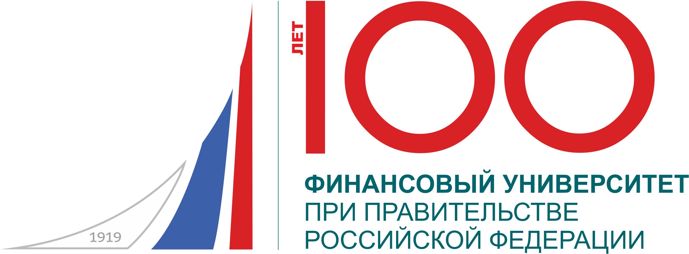

# Игра "Клондайк" на python

> Игра ведётся на игровом поле размером 10 на 10 клеток. Игроки по очереди выставляют в любую свободную клетку по отметке, и тот игрок, после чьего хода получилась цепочка длиной хотя бы в 3 отметке, проигрывает. При этом в цепочке считаются как свои отметки, так и отметки соперника, у игровых фишек как бы нет хозяина. Цепочка - это ряд фишек, следующая фишка в котором примыкает к предыдущей с любого из 8-ми направлений

<br>

Была запилена на первом курсе в рамках какой-то работы. Опенсорс - используйте, чтобы сдать повторно. Ход игры:

<br>

```
(base) MacBook-Air-tripolskypetr:~ tripolskypetr$ python /Users/tripolskypetr/Desktop/game.py 
Поле клондайк:
[False, False, False, False, False, False, False, False, False, False]
[False, False, False, False, False, False, False, False, False, False]
[False, False, False, False, False, False, False, False, False, False]
[False, False, False, False, False, False, False, False, False, False]
[False, False, False, False, False, False, False, False, False, False]
[False, False, False, False, False, False, False, False, False, False]
[False, False, False, False, False, False, False, False, False, False]
[False, False, False, False, False, False, False, False, False, False]
[False, False, False, False, False, False, False, False, False, False]
[False, False, False, False, False, False, False, False, False, False]
Введите координату:
X: 1
Y: 1
Поле клондайк:
[True, False, False, False, False, False, False, False, False, False]
[False, False, False, False, False, False, False, False, False, False]
[False, False, False, False, False, False, False, False, False, False]
[False, False, False, False, False, False, False, False, False, False]
[False, False, False, False, False, False, False, False, False, False]
[False, False, False, False, False, False, False, False, False, False]
[False, False, False, False, False, False, False, False, False, False]
[False, False, False, False, False, False, False, False, False, False]
[False, False, False, False, False, False, False, False, False, False]
[False, False, False, False, False, False, False, False, False, False]
Введите координату:
X: 3
Y: 3
Поле клондайк:
[True, False, False, False, False, False, False, False, False, False]
[False, False, False, False, False, False, False, False, False, False]
[False, False, True, False, False, False, False, False, False, False]
[False, False, False, False, False, False, False, False, False, False]
[False, False, False, False, False, False, False, False, False, False]
[False, False, False, False, False, False, False, False, False, False]
[False, False, False, False, False, False, False, False, False, False]
[False, False, False, False, False, False, False, False, False, False]
[False, False, False, False, False, False, False, False, False, False]
[False, False, False, False, False, False, False, False, False, False]
Введите координату:
X: 4
Y: 4
Поле клондайк:
[True, False, False, False, False, False, False, False, False, False]
[False, False, False, False, False, False, False, False, False, False]
[False, False, True, False, False, False, False, False, False, False]
[False, False, False, True, False, False, False, False, False, False]
[False, False, False, False, False, False, False, False, False, False]
[False, False, False, False, False, False, False, False, False, False]
[False, False, False, False, False, False, False, False, False, False]
[False, False, False, False, False, False, False, False, False, False]
[False, False, False, False, False, False, False, False, False, False]
[False, False, False, False, False, False, False, False, False, False]
Введите координату:
X: 6
Y: 6
Поле клондайк:
[True, False, False, False, False, False, False, False, False, False]
[False, False, False, False, False, False, False, False, False, False]
[False, False, True, False, False, False, False, False, False, False]
[False, False, False, True, False, False, False, False, False, False]
[False, False, False, False, False, False, False, False, False, False]
[False, False, False, False, False, True, False, False, False, False]
[False, False, False, False, False, False, False, False, False, False]
[False, False, False, False, False, False, False, False, False, False]
[False, False, False, False, False, False, False, False, False, False]
[False, False, False, False, False, False, False, False, False, False]
Введите координату:
X: 7
Y: 7
Поле клондайк:
[True, False, False, False, False, False, False, False, False, False]
[False, False, False, False, False, False, False, False, False, False]
[False, False, True, False, False, False, False, False, False, False]
[False, False, False, True, False, False, False, False, False, False]
[False, False, False, False, False, False, False, False, False, False]
[False, False, False, False, False, True, False, False, False, False]
[False, False, False, False, False, False, True, False, False, False]
[False, False, False, False, False, False, False, False, False, False]
[False, False, False, False, False, False, False, False, False, False]
[False, False, False, False, False, False, False, False, False, False]
Введите координату:
X: 7
Y: 6
[True, False, False, False, False, False, False, False, False, False]
[False, False, False, False, False, False, False, False, False, False]
[False, False, True, False, False, False, False, False, False, False]
[False, False, False, True, False, False, False, False, False, False]
[False, False, False, False, False, False, False, False, False, False]
[False, False, False, False, False, True, False, False, False, False]
[False, False, False, False, False, True, True, False, False, False]
[False, False, False, False, False, False, False, False, False, False]
[False, False, False, False, False, False, False, False, False, False]
[False, False, False, False, False, False, False, False, False, False]
Вы проиграли
```


